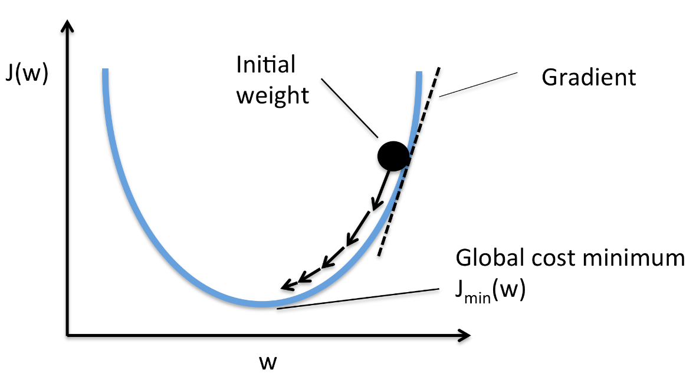

# Backpropagation

## Table of Contents

- [Loss backprop](#how-to-design-proper-backpropagation-logic)
- [Linear Backpropagation](#linear-backpropagation)
- [ReLU Backpropagation](#reLU-backpropagation)
- [Optimization – SGD](#optimization)
- [Simple NN](#simple-nn)

Now that we have implemented the **forward pass** of the neural network, let's move to **backpropagation**.

Backpropagation in this task uses the **chain rule** to track gradients through each layer.

## How to design proper backpropagation logic

From the network diagram, we can see that we need to propagate the gradient **backward from the loss to each layer**.

For the **Mean Squared Error (MSE)** loss:
$$ L = \frac{1}{n} \sum (Y*{\text{pred}} - Y*{\text{true}})^2 $$

$$
Y_{pred} = \begin{bmatrix} y^{pred}_1 \\ y^{pred}_2 \\ \vdots \\ y^{pred}_n \end{bmatrix},
Y_{true} = \begin{bmatrix} y^{true}_1 \\ y^{true}_2 \\ \vdots \\ y^{true}_n
 \end{bmatrix}
$$

Therefore:

$$
L = \frac{1}{n}
\left[
(y_1^{pred} - y_1^{true})^2 +
(y_2^{pred} - y_2^{true})^2 +
\cdots +
(y_n^{pred} - y_n^{true})^2
\right]
$$

$$
\frac{\partial L}{\partial y_j^{pred}}
= \frac{1}{n} \, 2 (y_j^{pred} - y_j^{true})
$$

Because the loss $L$ is a scalar, its Jacobian w.r.t. $\mathbf{O}$ is a row vector

$$
\frac{\partial L}{\partial Y^{pred}}
=
\begin{bmatrix}
\frac{\partial L}{\partial y_1^{pred}},
\frac{\partial L}{\partial y_2^{pred}},
\cdots,
\frac{\partial L}{\partial y_n^{pred}}
\end{bmatrix}
$$

$$
\frac{\partial L}{\partial Y^{pred}}
=
\frac{2}{n}
\begin{bmatrix}
y_1^{pred} - y_1^{true},
y_2^{pred} - y_2^{true},
\cdots,
y_n^{pred} - y_n^{true}
\end{bmatrix}
$$

Since $Y_{pred}$ and $Y_{true}$ are column vectors,
it is convenient to represent the gradient $\frac{\partial L}{\partial Y^{pred}}$ as a column vector as well, so that its shape matches $\frac{\partial L}{\partial Y^{pred}}$ and can be used directly in subsequent vectorized computations

$$
\frac{\partial L}{\partial Y^{pred}}
=
\frac{2}{n}
\begin{bmatrix}
y_1^{pred} - y_1^{true}\\
y_2^{pred} - y_2^{true}\\
\vdots\\
y_n^{pred} - y_n^{true}
\end{bmatrix}
$$

$$
\frac{\partial L}{\partial Y^{pred}}
= \frac{2}{n}(Y^{pred} - Y^{true})
$$

This derivative is the `starting point` of backpropagation. It will be sent backward through each layer using the **chain rule**, allowing us to compute gradients for all weights and biases in the network.

now MSE code is updated to

```python
class MSE:
    def forward(self, y_pred, y_true):
        self.y_pred = y_pred

        if y_true.ndim == 1:
            num_classes = y_pred.shape[1]
            self.y_true = xp.eye(num_classes)[y_true]
        else:
            self.y_true = y_true

        self.y_true = self.y_true.astype(y_pred.dtype)
        loss = xp.mean((y_pred - self.y_true) ** 2)
        return loss

    def backward(self): # dL/dY_pred
        return 2 * (self.y_pred - self.y_true) / self.y_true.shape[0]
```

For the **Cross-Entropy Loss** loss:

$$
L = -\frac{1}{n} \sum_{i=1}^{n} \sum_{c=1}^{C}
y^{true}_{ic} \log(y^{pred}_{ic})
$$

Therefore:

$$
L = -\frac{1}{n} \Bigg[
\sum_{c=1}^{C} y_{1c}^{\text{true}} \log(y_{1c}^{\text{pred}}) +
\sum_{c=1}^{C} y_{2c}^{\text{true}} \log(y_{2c}^{\text{pred}}) +
\cdots +
\sum_{c=1}^{C} y_{nc}^{\text{true}} \log(y_{nc}^{\text{pred}})
\Bigg]
$$

$$
\frac{\partial L}{\partial y_{jc}^{\text{pred}}}
= - \frac{\partial}{\partial y_{jc}^{\text{pred}}} \sum_{c=1}^{C} y_{jc}^{\text{true}} \log(y_{jc}^{\text{pred}})
$$

We know that:
$$ \frac{d}{dx} \log(x) = \frac{1}{x} $$
Applying this to the term

$$
-\frac{\partial}{\partial y_{jc}^{\text{pred}}} \big( y_{jc}^{\text{true}} \log(y_{jc}^{\text{pred}}) \big)
= - \frac{y_{jc}^{\text{true}}}{y_{jc}^{\text{pred}}}
$$

For sample $ j $, the gradient with respect to the predicted vector $ \mathbf{y_j}^{\text{pred}} $ is:

$$
\frac{\partial L}{\partial \mathbf{y}_j^{\text{pred}}} =
-\frac{1}{n}
\begin{bmatrix}
\frac{y_{j1}^{\text{true}}}{y_{j1}^{\text{pred}}} \\
\frac{y_{j2}^{\text{true}}}{y_{j2}^{\text{pred}}} \\
\vdots \\
\frac{y_{jC}^{\text{true}}}{y_{jC}^{\text{pred}}}
\end{bmatrix}
$$

$$
\frac{\partial L}{\partial \mathbf{Y}^{\text{pred}}} = -\frac{1}{n} \frac{\mathbf{Y}^{\text{true}}}{\mathbf{Y}^{\text{pred}}}
$$

```python
class CrossEntropy:
    def forward(self, y_pred, y_true):
        self.y_pred = y_pred # Store predictions for backward pass

        # If labels are 1D (class indices), convert them to one-hot encoding
        if y_true.ndim == 1:
            num_classes = y_pred.shape[1]  # Number of output classes
            self.y_true = np.eye(num_classes)[y_true]  # One-hot encode
        else:
            self.y_true = y_true  # Already one-hot encoded

        # Match dtype with predictions
        self.y_true = self.y_true.astype(y_pred.dtype)

        # Clip predictions to avoid log(0) which can cause numerical issues
        y_pred_clipped = np.clip(y_pred, 1e-12, 1.0)

        # Compute cross-entropy loss:
        #   - sum over classes for each sample
        #   - then average over all samples
        loss = -np.mean(np.sum(self.y_true * np.log(y_pred_clipped), axis=1))
        return loss

    def backward(self):
        N = self.y_pred.shape[0]  # batch size
        # Gradient: (y_pred - y_true) / N
        grad = (self.y_pred - self.y_true) / N
        return grad
```

## Linear Backpropagation

$\frac{\partial L}{\partial W} = dY^T X $

$\frac{\partial L}{\partial b} = \text{sum}(dY, \text{axis}=0)$

$\frac{\partial L}{\partial X} = dY \, W$

If you want to know more information how this formula from. i recommned you read this [Linear Backpropagation ](./02_backprop_linear.md)

```python
class Linear(Module):
    def __init__(self, *args):
        super().__init__()
        # Normal mode: user specifies input and output size
        if len(args) == 2:  # example: Linear(128, 32)
            in_features, out_features = args
            self.deferred_init = False
            self.initialize_params(in_features, out_features)

        # Deferred initialization: Linear(32)
        elif len(args) == 1:
            (out_features,) = args
            self.deferred_init = True
            self.out_features = out_features
            self.W = None
            self.b = None
        else:
            raise ValueError("Linear expects 1 or 2 arguments")


    def initialize_params(self, in_features, out_features):
        # simple
        self.W = Parameter(np.random.randn(in_features, out_features) * 0.01)   # (in_features, out_features, )

        # Kaiming He normal initialization (best for ReLU networks)
        # std = np.sqrt(2.0 / in_features)
        # self.W = Parameter(np.random.randn(in_features, out_features) * std)  # (in_features, out_features, )

        self.b = Parameter(np.zeros(out_features)) # (output_features,)


    def forward(self, x):
        # Deferred initialization
        if self.deferred_init and self.W is None:
            in_features = x.shape[-1]
            self.initialize_params(in_features, self.out_features)
            self.deferred_init = False

        self.x = x
        # x: (batch, in_features)
        return x @ self.W.data.T + self.b.data  # (batch, out_features)


    def backward(self, grad_output):
        # grad_output: (batch, out_features)

        # dW: (out_features, in_features)
        self.W.grad += grad_output.T @ self.x

        # db: (out_features)
        self.b.grad += grad_output.sum(axis=0)

        # dX: (batch, in_features)
        return grad_output @ self.W.data
```

## ReLU Backpropagation

The **ReLU** activation function is defined as:
$$ f(x) = \max(0, x) $$

For the **backward pass**, we need the gradient with respect to the input $x$:

$$ \frac{\partial L}{\partial x} = \frac{\partial L}{\partial y} \cdot \frac{\partial y}{\partial x} $$

Where:

$$
f(x) =
\begin{cases}
x & \text{if } x > 0 \\
0 & \text{if } x \leq 0
\end{cases}
→
\frac{\partial y}{\partial x} =
\begin{cases}
1 & \text{if } x > 0 \\
0 & \text{if } x \leq 0
\end{cases}
$$

where $`\frac{\partial y}{\partial x}`$ represents the gradient of ReLU with respect to its input.

$`\frac{\partial L}{\partial y}`$ is the gradient coming from the **previous layer**.
So the gradient with respect to the input (x) is:

$$ \text{grad}_{\text{output}} = \text{grad}_{\text{input}} \cdot \text{mask} $$

`mask = x > 0` is stored during the forward pass.

```python
class ReLU(Module):
    def forward(self, x):
        self.mask = x > 0
        return x * self.mask

    def backward(self, grad_input):
        return grad_input * self.mask
```

## Optimization



It is used to update the weights and biases of a neural network during training. SGD adjusts the parameters in the direction that minimizes the loss function (towards a local or global minimum of the cost function).

From the images, you can see:

- If the gradient is positive (right curve), increasing the weight will increase the loss, so we need to decrease the weight.
- If the gradient is negative (left curve), increasing the weight will decrease the loss, so we need to increase the weight.

---

### SGD (Stochastic Gradient Descent)

$${W_{new}​=W_{old}​−η⋅∇_W​Loss}$$

- ${W_{old}}$ is the current weight of that layer (stored in the `Parameter.data` attribute)
- $∇_W​Loss$ (Gradient) represents how much the loss changes with respect to the $W$. (stored in the `Parameter.grad` attribute)
- η (Learning Rate): is a small fixed value (typically between 1e-5 to 0.1) that controls the step size for updates. As shown in the right image, finding the appropriate learning rate is a challenge. There are methods to help with this, which we will discuss in the other chapter.

To allow an optimizer to update all weights and biases, the `Module class` must expose its parameters.
The updated implementation is shown below:

```python
class Module:
    def __init__(self):
        self.params = {}

    def forward(self, *args, **kwargs):
        raise NotImplementedError

    def __call__(self, *args, **kwargs):
        return self.forward(*args, **kwargs)

    # ADD
    def __setattr__(self, name, value):
        if isinstance(value, Parameter):
            self.params[name] = value
        super().__setattr__(name, value)

    def parameters(self):
        params = list(self.params.values())
        for attr in self.__dict__.values():
            if isinstance(attr, Module):
                params.extend(attr.parameters())
        return params
```

`__setattr__` automatically stores any assigned **Parameter** in params \
`parameters` method collects all parameters from **this module and its submodules** for the optimizer to update

```python
class SGD:
    def __init__(self, _module, lr=0.01):
        # Check if the input _module is an instance of the Module class
        # (e.g., Linear, Activation layers)
        if isinstance(_module, Module):  # If it's a Module, get all the parameters (weights and biases)
            self._module = _module.parameters()
        else:
            # If it's already a list of parameters, assign it directly
            self._module = _module
        self.lr = lr  # Set learning rate (default 0.01)

    def step(self):
        # Loop through all weights and biases of the model
        for param in self._module:
            # Update each weights and biases using SGD formula
            param.data -= self.lr * param.grad

    def zero_grad(self):
        for param in self._module:
            param.grad[...] = 0  # reset their gradients to zero to prevent accumulation from previous steps

```

## Evaluate inference

When training a model, we need a way to check how well it is doing.
Evaluation metrics tell us how good the model’s predictions are.

Accuracy is the most common metric for classification tasks, but many others exist (e.g., precision, recall, F1-score).

Typically, we compute these metrics at the end of each epoch to monitor training progress and detect issues such as underfitting or overfitting.

```python
def accuracy(logits, targets):
    preds = xp.argmax(logits, axis=1)
    return xp.mean(preds == targets)
```

## Simple NN

Now that all core components are implemented (layers, activations, loss functions, and optimizer), we can combine them into a small neural network and test the full training pipeline.

⚠️ This code uses `randomly generated values` for the dataset and test set, so the `accuracy` will be `very low` and the `loss very high`. It is intended only to simulate that the `pipeline works correctly`.

```python
class MyModel(Module):
    def __init__(self):
        super().__init__()
        self.fc1 = Linear(784, 128)
        self.relu1 = ReLU()
        self.fc2 = Linear(128, 32)
        self.relu2 = ReLU()
        self.fc3 = Linear(32, 10)

    def forward(self, x):
        x = self.fc1(x)
        x = self.relu1(x)
        x = self.fc2(x)
        x = self.relu2(x)
        x = self.fc3(x)
        return x

    def backward(self, grad_output):
        grad_output = self.fc3.backward(grad_output)
        grad_output = self.relu2.backward(grad_output)
        grad_output = self.fc2.backward(grad_output)
        grad_output = self.relu1.backward(grad_output)
        grad_output = self.fc1.backward(grad_output)
        return grad_output

```

```python
epochs = 10         # Number of epochs
batch_size = 10     # Number of samples
num_classes = 10    # Number of class

# loss_fn = MSE()
loss_fn = CrossEntropy()

initial_lr = 0.01
optimizer = SGD(model, lr=initial_lr)

# input (random images)
X_random = np.random.rand(batch_size, 784)   # shape: (10,784)

# labels (random class indices 0–9)
y_indices = np.random.randint(0, num_classes, size=batch_size)

# y_batch = np.eye(num_classes)[y_indices]
# Not needed because we defined the loss to handle both label encoding and one-hot encoding.

model = MyModel()   # Instantiate the model

# Training loop
for epoch in range(epochs):
    for i in range(0, X_random.shape[0], batch_size):
        # Get the current batch
        x_batch = X_random[i:i+batch_size]
        y_batch = y_indices[i:i+batch_size]

        # Forward pass
        logits = model.forward(x_batch)
        loss = loss_fn.forward(logits, y_batch)

        # Backward pass
        grad_output = loss_fn.backward()  # Get gradient of the loss
        model.backward(grad_output)  # Propagate gradients back through the model

        # Update parameters
        optimizer.step()
        optimizer.zero_grad()  # Reset gradients

        iter_num = i // batch_size + 1

    # Evaluate on the entire training set
    logits_train = model.forward(X_random)
    train_loss = loss_fn.forward(logits_train, y_indices)
    train_acc = accuracy(logits_train, y_indices)

    # Print progress for the current epoch
    print(f"Epoch {epoch+1} Summary: "
          f"Train Acc={train_acc:.4f}, Train Loss={train_loss:.4f}")
```

### Steps for Training the Model

`Training Loop`:
Now, we get into the main training loop. For each epoch, we loop through the training data in batches. For each batch, we take a chunk of data and labels:

```python
x_batch = X_random[i:i+batch_size]
y_batch = y_indices[i:i+batch_size]
```

We need to repeat this until we’ve gone through the entire dataset.

---

`Forward Pass`: Once we have a batch, we give it to the model to make predictions:

```python
logits = model.forward(x_batch)
```

Then, we calculate the loss by comparing the predictions (logits) with the actual labels (y_batch):

```python
loss = loss_fn.forward(logits, y_batch)
```

---

`Backward Pass`:
Now, it’s time to figure out how to improve. We get the gradients from the loss function:

```python
grad_output = loss_fn.backward()
```

Then, we backpropagate these gradients through the model to update the weights:

```python
model.backward(grad_output)
```

---

`Parameter Update`:
After backpropagation computes all gradients, the optimizer updates the model’s weights and biases using the SGD rule.

```python
optimizer.step()
```

When you call parameters(), it collects every Parameter object from all layers in the model.
For example, when you write:

```python
self.fc1 = Linear(784, 128)
```

the Linear layer creates:

```python
self.W = Parameter(...)
self.b = Parameter(...)
```

So in the parameter list: \
`self.W` appears as the first Parameter object \
`self.b` appears as the second Parameter object

This continues for every layer, meaning the printed list contains all model weights and biases, ready for the optimizer to update.

---

`Reset Gradients`:
After the weights have been updated, we reset the gradients to zero so they’re ready for the next batch:

```python
optimizer.zero_grad()
```

---

`Next Batch`:
We then move on to the next batch of data and repeat the process until we’ve gone through all the training data.

```python
iter_num = i // batch_size + 1
```

---

`Evaluate`:
After each epoch, we evaluate the model on both entire training set (X_train) and test set (X_test). We compute the accuracy and loss for both, so we can track how well the model is learning and how well it generalizes.
