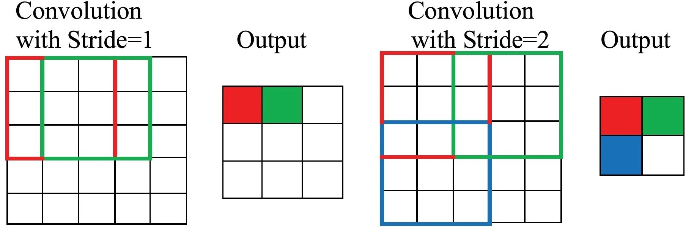
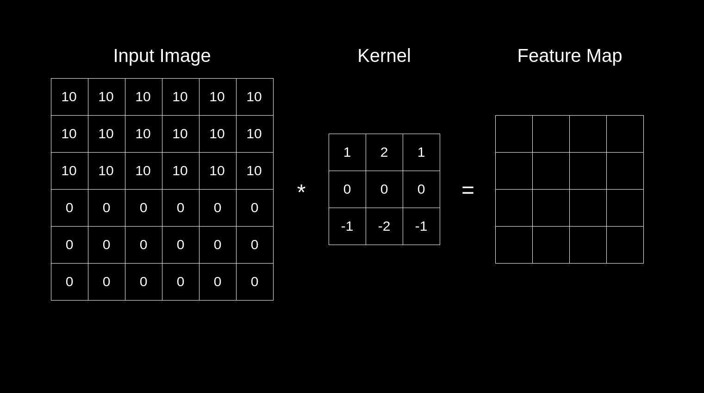
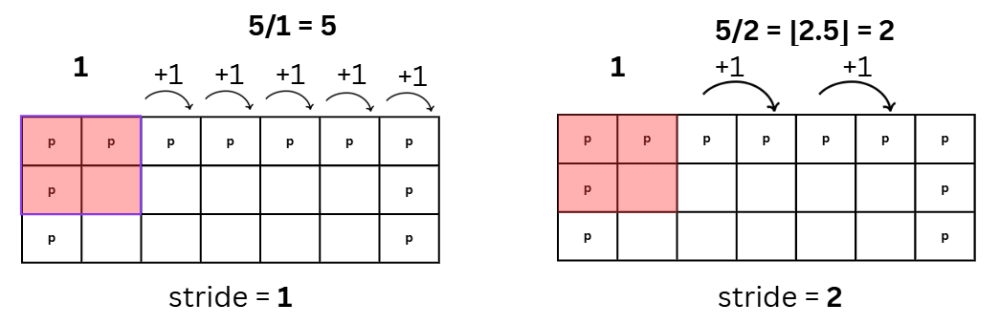
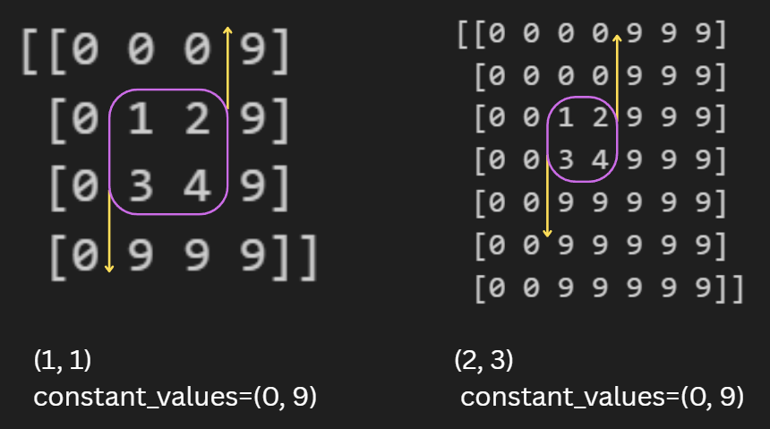
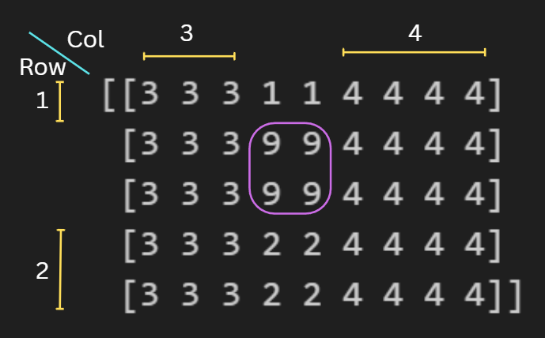

# Section 2: Convolutional Neural Networks (CNNs)

In the previous section, we built an Artificial Neural Network (ANN) that performed well on the MNIST dataset. However, if we switch to more complex datasets, such as dog vs. cat images, the model's accuracy drops significantly.

The main reasons are:

- Position sensitivity: ANNs flatten the image, so each pixel is treated independently. If the object moves even slightly, the model struggles, even if the image is the same.

- Spatial information loss: Flattening destroys the 2D structure of images. Nearby pixels lose their relationship.

- Parameter explosion: For bigger images, fully connected layers need tons of weights, making training slow and prone to overfitting.

This is where CNNs come in. CNNs are designed to handle images better by keeping the spatial structure intact and learning local patterns.

## Convolution Layer

<div style="display: flex; justify-content: center; gap: 10px;">
    
    
</div>

The convolution layer is the core building block of a CNN. It has three main components:

### Filters (Kernels)

Filters are small matrices that slide across the image to detect patterns like edges, textures, corners, or shapes.\
You can think of each filter as a set of local weights, similar to ANN weights but applied only to small patches of the image.

Filter has 3 dimensions:

- H → filter height
- W → filter width
- C → filter depth taht must match the number of input channels (1 for grayscale, 3 for RGB, etc.)

How it works:

1. Take a small patch of the input (same size as the filter).
2. Multiply the patch with the filter values (element-wise).
3. Sum all values → this gives one scalar for that channel.
4. If the input has multiple channels (like RGB):

- Each channel has different filter values.
- Compute step 1–3 for each channel, then sum across channels → final output value.
- Each filter produces a feature map, and multiple filters can detect different patterns.
  so the number of filters = the number of output channels of the conv layer.

### Stride

The stride is how many pixels the filter moves each step.

- Larger stride → output shrinks (downsampling).
- Smaller stride → more detailed feature map.
- Strides can be different in x and y directions: stride_x = 2, stride_y = 3.

### Padding

Padding adds extra pixels (usually zeros) around the image:

- Allows the filter to slide over the border properly.
- Can keep output size the same as input.

`Left image`

- Filter: 3×3
- Stride: 2×2
- No padding
- Only one channel, so the filter matrix is the same everywhere.

`Right image`:

- Filter: 3×3
- Stride: 1×1
- No padding
- Each patch multiply filter → sum all values


- Filter: 3×3
- Stride: 1×1
- Padding = (1, 1)
- Each patch multiply filter → sum all values -> sum across channel
  this has only one filter so output channel = 1

### Input and Output of a Convolution Layer

Input Shape: ${(H_{input} ​,W_{input} ​,C_{input} ​)}$
Output Shape: ${(H_{output} ​,W_{output} ​,C_{output} ​)}$

${H_{output} ​,W_{output}}$ depends on filter, stride and padding size
while C\_{output} depends on number of filter



For example (Left side):

- Image size = 5×5, filter = 2×2 , padding = 1, and stride = 1
- the padded width becomes 5 + 2 = 7.
- To find how many times the filter can move, we subtract the filter size 7 − 2 = 5
- Divide by the stride 5 / 1 = 5
- Finally add 1 for the initial starting position -> output width = 6.

In cases where the stride does not fit perfectly (right side)

- just apply floor function in (padded_size − filter_size) / stride

Formula:
$$output = \frac{\left\lfloor input + 2 \cdot padding - filter \right\rfloor }{stride}+ 1$$

You can see that increasing the filter size or the stride reduces the output height and width. If you want to preserve the input dimensions (i.e., keep $𝐻_{𝑜𝑢tput}$= $𝐻_{input}$ and $W_{𝑜𝑢tput}$= $W_{input}$, you need to choose padding, filter, and stride so that the fraction equals the input size. \
For example,

- stride = 1, filter = 3, padding = 1
- stride = 1, filter = 2, padding = 0

Let's code them in simple form

## Padding

```python
x = np.array([
        [1, 2,],
        [3, 4,],

    ])
pad_arr = np.pad(x, (2, 3), 'constant',
                 constant_values=(0, 9))
pad_arr
```

Result:

```
[[0 0 0 0 9 9 9]
 [0 0 0 0 9 9 9]
 [0 0 1 2 9 9 9]
 [0 0 3 4 9 9 9]
 [0 0 9 9 9 9 9]
 [0 0 9 9 9 9 9]
 [0 0 9 9 9 9 9]]
```

`(2, 3)` means we pad 2 element before each axis and 2 elements after each axis.
So for a 2D array, that becomes: \
top = 2, left = 2 \
bottom = 3, right = 3

This padding is applied uniformly to `all` dimensions.

`constant_values=(0, 9)` means: \
The padding on the **top and left** uses **0** \
The padding on the **bottom and right** uses **9**



> For a multi-dimensional array like (N, C, H, W), using (2, 3) will also pad the batch and channel dimensions, which is usually not what we want.

```python
x = np.array([
    [9, 9],
    [9, 9]
])

pad_arr = np.pad(
    x,
    pad_width=((1, 2), (3, 4)),
    mode='constant',
    constant_values=((1, 2), (3, 4))
)
pad_arr
```

Result:

```
[[3 3 3 1 1 4 4 4 4]
 [3 3 3 9 9 4 4 4 4]
 [3 3 3 9 9 4 4 4 4]
 [3 3 3 2 2 4 4 4 4]
 [3 3 3 2 2 4 4 4 4]]
```

NumPy applies padding axis by axis, starting with rows (axis 0) and then columns (axis 1).

Axis 0 (rows):

- Rows: pad 1 element on top and 2 on the bottom
- Top row padding = 1, bottom row = 2

Axis 1 (columns):

- Columns: pad 3 elements on the left and 4 on the right
- Left column padding = 3, right column = 4



```python
x = np.array([[
    [
        [9, 9],
        [9, 9]
    ]
]])

x_padded = np.pad(
    x,
    pad_width=((0,0), (0,0), (1, 2), (3, 4)),
    mode='constant',
    constant_values=((0,0), (0,0), (1, 2), (3, 4))
)
x_padded
```

Result:

```
[[[[3 3 3 1 1 4 4 4 4]
   [3 3 3 9 9 4 4 4 4]
   [3 3 3 9 9 4 4 4 4]
   [3 3 3 2 2 4 4 4 4]
   [3 3 3 2 2 4 4 4 4]]]]
```

Now the array is 4D: (N, C, H, W). The logic of padding is similar to 2D, but the first two axes (N and C) are not padded, so we set (0,0) for both pad_width and constant_values.

### Simple Conv2D

---

The forward pass of a convolution operation can be expressed as:
$${Y(i,j) = \sum_{m=1}^{M} \sum_{n=1}^{N} K(m,n) \cdot X(i+m-1,\; j+n-1) + b}$$
${Y(i,j)}$ is the output at position ${(i,j)}$\
${K(m,n)}$ is the kernel (filter) value at position ${(m,n)}$ \
${X(i+m−1,j+n−1)}$ is the input at the corresponding position, adjusted for the kernel's position \
$b$ is the bias term

### Step 1: Determine the valid range of ${(i, j)}$

Before applying the convolution formula, we must decide which positions the filter is allowed to start at.
The filter must always stay inside the padded input, so the number of valid positions is:

$H_{out} = \left\lfloor \frac{H_{input} + 2  P - K}{S} \right\rfloor + 1$

$W_{out} = \left\lfloor \frac{W_{input} + 2 P - K}{S} \right\rfloor + 1$

$i$ ranges over the $H_{out}$ rows\
​$j$ ranges over the $W_{out}$ ​columns

### Step 2: Kernel indexing (m, n)

The kernel is a small matrix of size M x N (usually K x K).
$$ m \in \{1, 2, 3, \dots, M\} , n \in \{1, 2, 3, \dots, N\} $$

When the filter is placed at output position $(i,j)$, the element at kernel position $(m,n)$ multiplies the input at: $X(i+m−1,j+n−1)$.\
The terms ${+m−1}$ and ${+n−1}$ shift the access from the filter's top-left anchor point $(i,j)$

The reason for ${i+m−1}$ and ${j+n−1}$ is that the index starts at 1. For example, at input index 0, the filter should cover the first two blocks, so it should reference indices 0 and 1, **not** 0, 1, and 2.

### Step 3: Compute the convolution output value

At each valid position ${(i,j)}$, the convolution computes:
$${Y(i,j) = \sum_{m=1}^{M} \sum_{n=1}^{N} K(m,n) \cdot X(i+m-1,\; j+n-1) + b}$$

1. Take a patch of the input aligned with the filter.
2. Multiply each input value by the corresponding kernel value.
3. Sum all products.
4. Add the bias $b$.
5. Store the result in ${Y(i,j)}$

```python
# Input (5x5)
x = np.array([
    [1, 2, 3, 4, 0],
    [0, 1, 2, 3, 4],
    [4, 0, 1, 2, 3],
    [3, 4, 0, 1, 2],
    [2, 3, 4, 0, 1]
])  # shape: (H, W) = (5, 5)

# Kernel (2x2)
kernel = np.array([
    [1, 0],
    [0, 1],
])  # shape: (KH, KW) = (2, 2)

# Strides
stride_x = 1  # horizontal stride
stride_y = 3  # vertical stride

H, W = x.shape     # H=5, W=5
KH, KW = kernel.shape  # KH=2, KW=2

# Output dimensions
H_out = (H - KH) // stride_y + 1  # H_out = 2
W_out = (W - KW) // stride_x + 1  # W_out = 4

out = np.zeros((H_out, W_out))  # shape: (H_out, W_out) = (2, 4)

# Convolution
for i in range(H_out):
    for j in range(W_out):
        start_i = i * stride_y
        start_j = j * stride_x
        region = x[start_i:start_i+KH, start_j:start_j+KW]  # shape: (KH, KW) = (2, 2)
        out[i, j] = np.sum(region * kernel)                # scalar

print("Output:\n", out)  # shape: (H_out, W_out) = (2, 4)
```

Result:

```
out:
 [[2. 4. 6. 8.]
 [8. 0. 2. 4.]]
```

How it works:

1. First, calculate the size of the output matrix using this formula:
   $$
   H_\text{out} = \left\lfloor \frac{H + 2p - M}{s} \right\rfloor + 1, \quad
   W_\text{out} = \left\lfloor \frac{W + 2p - N}{s} \right\rfloor + 1
   $$
   This tells us how many valid patches the kernel can slide over.
2. Loop over each possible patch of the input:

- Start from the top-left corner of the patch.
- Take a region of size kernel height × kernel width.
- Multiply element-wise with the kernel, sum the values, and put the result in the output matrix.

3. Continue this process until all patches have been applied to the kernel

```python
# Parameters
N = 4               # number of batch size
C_in = 3            # input channels
F_out = 2           # number of filters/output channels
KH, KW = 3, 3       # kernel size
stride = 1

# Input: batch of 3 channels, 5x5
x = np.random.randint(0, 5, (N, C_in, 5, 5))  # (N, C_in, H, W) = (4, 3, 5, 5)

# Initialize kernels
W = np.random.randint(-1, 2, (F_out, C_in, KH, KW))     # (F_out, C_in, KH, KW) = (2, 3, 3, 3)
b = np.random.randint(0, 2, F_out)                      # (F_out,) = (2,)

H, W_in = x.shape[2], x.shape[3]                    # H = 5, W_in = 5
H_out = (H - KH) // stride + 1                      # output height = 3
W_out = (W_in - KW) // stride + 1                   # output width = 3

out = np.zeros((N, F_out, H_out, W_out))           # output shape = (N, F_out, H_out, W_out) = (4, 2, 3, 3)

# Perform convolution
for n in range(N):          # loop over batch
    for f in range(F_out):
        for c in range(C_in):  # for each input channel
            for i in range(H_out):
                for j in range(W_out):
                    start_i = i * stride
                    start_j = j * stride
                    region = x[n, c, start_i:start_i+KH, start_j:start_j+KW]  # (KH, KW) = (3, 3)
                    out[n, f, i, j] += np.sum(region * W[f, c])                # scalar sum
        out[n, f] += b[f]  # add bias

print("Input shape:", x.shape)
print("Weight shape:", W.shape)
print("Output shape:", out.shape)
print("Output:\n", out)

```

Result:

```python
Input shape: (4, 3, 5, 5)
Weight shape: (2, 3, 3, 3)
Output shape: (4, 2, 3, 3)
Output:
[[[[ 11.  -6.  16.]
   [  5.   4.  -2.]
   [ -3. -11. -12.]]

  [[  2.  -8.   4.]
   [-15. -12. -11.]
   [-11.  -6.   2.]]]

 [[[ -2.   0.  -5.]
   [ -1.   5.  -7.]
   [ -7.  -7.   0.]]
...

  [[ -1.  -6. -20.]
   [-15.  -9.   4.]
   [ -4.  -9.  -5.]]]]
```

Now we will apply it Module to it

```python
class Conv2d(Module):
    def __init__(self, in_channels, out_channels, kernel_size, stride=1, padding=0):
        super().__init__()

        if isinstance(kernel_size, int):
            kernel_size = (kernel_size, kernel_size)

        self.stride = stride
        self.padding = padding
        self.KH, self.KW = kernel_size

        # He initialization
        scale = np.sqrt(2 / (in_channels * self.KH * self.KW))
        self.W = Parameter(scale * np.random.randn(out_channels, in_channels, self.KH, self.KW))
        self.b = Parameter(np.zeros(out_channels))

        self.x = None

    def forward(self, x):
        self.x = x
        N, C, H, W_in = x.shape
        KH, KW = self.KH, self.KW
        stride, pad = self.stride, self.padding
        F_out = self.W.data.shape[0]

        # Output dimensions
        H_out = (H + 2*pad - KH) // stride + 1
        W_out = (W_in + 2*pad - KW) // stride + 1

        out = np.zeros((N, F_out, H_out, W_out))

        # Pad input
        x_padded = np.pad(x, ((0,0),(0,0),(pad,pad),(pad,pad)), mode="constant")

        # Convolution loops: batch → filters → input channels → height → width
        for n in range(N):
            for f in range(F_out):
                for c in range(C):
                    for i in range(H_out):
                        for j in range(W_out):
                            start_i = i * stride
                            start_j = j * stride
                            region = x_padded[n, c, start_i:start_i+KH, start_j:start_j+KW]
                            out[n, f, i, j] += np.sum(region * self.W.data[f, c])
                out[n, f] += self.b.data[f]

        return out
```

## Pooling Layer

Pooling layers shrink the spatial size of feature maps while retaining the **most** important information, which also reduces computation. The most common type, Max Pooling, simply takes the maximum value within each window.


$$ Y*{i,j} = \max*{(m,n) \in W*{i,j}} X*{m,n} $$

Example (2x2 window):

$$
X_{window} =
\begin{bmatrix}
x_1 & x_3 \\
x_2 & x_4
\end{bmatrix}
\quad \implies \quad
Y = \max(x_1, x_2, x_3, x_4)
$$

```python
# Input (5x5)
x = np.array([
    [1, 2, 3, 4, 0],
    [0, 1, 2, 3, 4],
    [4, 0, 1, 2, 3],
    [3, 4, 0, 1, 2],
    [2, 3, 4, 0, 1]
])  # shape: (H, W) = (5, 5)

# Pool space
pool_size_x = 2  # width of pooling window
pool_size_y = 2  # height of pooling window

# Strides
stride_x = 1  # horizontal stride
stride_y = 2  # vertical stride

# Input shape
H, W = x.shape  # H=5, W=5

# Output shape
H_out = (H - pool_size_y) // stride_y + 1  # H_out = 2
W_out = (W - pool_size_x) // stride_x + 1  # W_out = 4

# Output and global mask
out = np.zeros((H_out, W_out))             # shape: (H_out, W_out) = (2, 4)
mask = np.zeros_like(x, dtype=int)         # shape: (H, W) = (5, 5)

# Max-pooling forward + mask creation
for i in range(H_out):
    for j in range(W_out):
        start_i = i * stride_y
        start_j = j * stride_x

        # Current pooling window
        region = x[start_i:start_i+pool_size_y, start_j:start_j+pool_size_x]  # shape: (2, 2)

        # Max value in the window
        max_val = np.max(region)
        out[i, j] = max_val  # scalar

        # Local mask for this window (1 where max, 0 elsewhere)
        local_mask = (region == max_val).astype(int)

        # Add local mask into the global mask
        mask[start_i:start_i+pool_size_y, start_j:start_j+pool_size_x] += local_mask


print("Input x:\n", x)
print("\nPooled output out:\n", out)
print("\nGlobal mask:\n", mask)
```

Result:

```
Input x:
 [[1 2 3 4 0]
 [0 1 2 3 4]
 [4 0 1 2 3]
 [3 4 0 1 2]
 [2 3 4 0 1]]

Pooled output out:
 [[2. 3. 4. 4.]
 [4. 4. 2. 3.]]

Global mask:
 [[0 1 1 2 0]
 [0 0 0 0 1]
 [1 0 0 1 1]
 [0 2 0 0 0]
 [0 0 0 0 0]]
```

You can see that the max pooling code uses the **same idea** as `Simple Conv2D`

```python
# Input: batch of 2 samples, 3 channels, 5x5
N = 2
C = 3
H = 5
W = 5
x = np.random.randint(0, 5, (N, C, H, W))  # shape: (2, 3, 5, 5)

# Pool space
pool_size_x = 2  # width of pooling window
pool_size_y = 2  # height of pooling window

# Strides
stride_x = 1  # horizontal stride
stride_y = 2  # vertical stride

# Output size
H_out = (H - pool_size_y) // stride_y + 1  # 2
W_out = (W - pool_size_x) // stride_x + 1  # 4

# Output and mask
out = np.zeros((N, C, H_out, W_out))        # shape: (2, 3, 2, 4)
mask = np.zeros_like(x, dtype=int)          # shape: (2, 3, 5, 5)

# Max-pooling forward + mask creation
for n in range(N):
    for c in range(C):
        for i in range(H_out):
            for j in range(W_out):
                start_i = i * stride_y
                start_j = j * stride_x

                # Current pooling window
                region = x[n, c, start_i:start_i+pool_size_y, start_j:start_j+pool_size_x]  # shape: (2,2)

                # Max value
                max_val = np.max(region)
                out[n, c, i, j] = max_val

                # Local mask (1 where max, 0 elsewhere)
                local_mask = (region == max_val).astype(int)

                # Add local mask to the global mask
                mask[n, c, start_i:start_i+pool_size_y, start_j:start_j+pool_size_x] += local_mask

print('channel 0')
print("Input sample \n", x[0, 0])
print("\nPooled output sample \n", out[0, 0])
print("\nMask sample \n", mask[0, 0])
```

Result:

```
channel 0
Input sample
 [[4 3 3 4 2]
 [0 1 2 4 4]
 [1 1 4 1 0]
 [1 0 3 2 2]
 [2 3 1 2 0]]

Pooled output sample
 [[4. 3. 4. 4.]
 [1. 4. 4. 2.]]

Mask sample
 [[1 1 1 2 0]
 [0 0 0 2 1]
 [1 1 2 0 0]
 [1 0 0 1 1]
 [0 0 0 0 0]]
```

```python
class MaxPool2d:
    def __init__(self, pool_size=(2,2), stride=(1,1)):
        # Ensure pool_size and stride are tuples (height, width)
        if isinstance(pool_size, int):
            pool_size = (pool_size, pool_size)
        if isinstance(stride, int):
            stride = (stride, stride)

        self.pool_size_y, self.pool_size_x = pool_size  # pooling window height and width
        self.stride_y, self.stride_x = stride          # stride in vertical and horizontal directions
        self.x = None     # cache input for backward pass
        self.mask = None  # cache mask for backward pass

    def forward(self, x):
        self.x = x      # input array of shape (N, C, H, W)
        N, C, H, W = x.shape

        # Calculate output height and width
        H_out = (H - self.pool_size_y) // self.stride_y + 1
        W_out = (W - self.pool_size_x) // self.stride_x + 1

        # Initialize output array and mask
        out = np.zeros((N, C, H_out, W_out))
        self.mask = np.zeros_like(x, dtype=int)  # shape (N, C, H, W)

        # Loop over batch, channels, and output spatial dimensions
        for n in range(N):
            for c in range(C):
                for i in range(H_out):
                    for j in range(W_out):
                        # Determine window start and end indices
                        start_i = i * self.stride_y
                        start_j = j * self.stride_x

                        # Extract region of input corresponding to the pooling window
                        region = x[n, c, start_i:start_i+self.pool_size_y,
                                   start_j:start_j+self.pool_size_x]

                        # Find max value in window
                        max_val = np.max(region)
                        out[n, c, i, j] = max_val

                        # Create local mask (1 where max, 0 elsewhere)
                        local_mask = (region == max_val).astype(int)

                        # Store local mask in the global mask
                        self.mask[n, c, start_i:start_i+self.pool_size_y,
                                  start_j:start_j+self.pool_size_x] += local_mask

        return out  # (N, C, H_out, W_out)

    def backward(self, grad_output):
        N, C, H, W = self.x.shape
        H_out, W_out = grad_output.shape[2], grad_output.shape[3]

        # Initialize gradient w.r.t input
        dx = np.zeros_like(self.x)

        # Loop over batch, channels, and output spatial dimensions
        for n in range(N):
            for c in range(C):
                for i in range(H_out):
                    for j in range(W_out):
                        start_i = i * self.stride_y
                        start_j = j * self.stride_x

                        # Use cached mask instead of recomputing
                        mask_window = self.mask[n, c, start_i:start_i+self.pool_size_y,
                                                start_j:start_j+self.pool_size_x]

                        # Distribute gradient to max locations
                        dx[n, c, start_i:start_i+self.pool_size_y,
                           start_j:start_j+self.pool_size_x] += mask_window * grad_output[n, c, i, j]

        return dx  # (N, C, H, W)
```

> The mask is not used in the forward pass, but it is useful in the backward pass.
