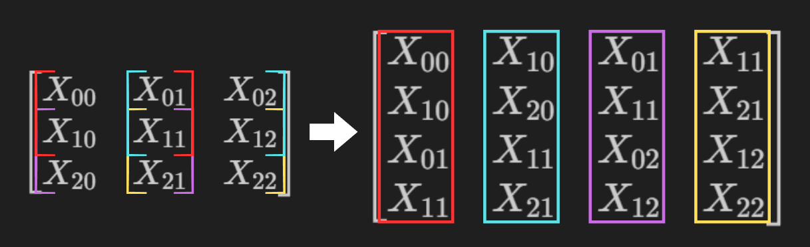

# Convolution Forward Pass Formula

This document explains the forward pass of a 2D convolution operation, including **padding** and **stride**.

## Notation

- Input: $X$ of size $H \times W$
- Kernel: $K$ of size $M \times N$
- Bias: $b$
- Stride:
  - $SH$: stride in the vertical (height) direction
  - $SW$: stride in the horizontal (width) direction
- Padding:
  - $PH$: padding in the vertical (height) direction
  - $PW$: padding in the horizontal (width) direction
- Output: $O$ of size $H_\text{out} \times W_\text{out}$

The output dimensions are given by:

$$
H_\text{out} = \left\lfloor \frac{H + 2PH - M}{SH} \right\rfloor + 1, \quad
W_\text{out} = \left\lfloor \frac{W + 2PW - N}{SW} \right\rfloor + 1
$$

---

## Forward Pass Formula

The output at position $(i, j)$ is calculated as:

$$
O(i,j) = \sum_{m=1}^{M} \sum_{n=1}^{N} K(m,n) \cdot X_\text{pad}\big(i \cdot SH + m - 1, \; j \cdot SW + n - 1\big) + b
$$

During backpropagation, we compute gradients with respect to three variables (K, b, X):

K: for updating the layer’s kernel weights\
b: for updating the layer’s biases\
X: the input; we return $dL/dX$ as the output to propagate the error to the next layer

### Gradient with respect to `b`

---

The conv layer is

$$
O(i,j) = \sum_{m=1}^{M} \sum_{n=1}^{N} K(m,n) \cdot X_\text{pad}\big(i \cdot s + m - 1, \; j \cdot s + n - 1\big) + b
$$

$$
\frac{\partial O(i,j)}{\partial b} = \frac{\partial}{\partial b} \Big( \sum_{m=1}^{M} \sum_{n=1}^{N} K(m,n) \cdot X_\text{pad}\big(i \cdot s + m - 1, \; j \cdot s + n - 1\big) + b) = \frac{\partial}{\partial b} \Big(  b \Big) = 1
$$

Therefore:

$$
\frac{\partial L}{\partial b} = \sum_{i,j}^{N} \frac{\partial L}{\partial O(i,j)}\frac{\partial O(i,j)}{\partial b}  =\sum_{i,j}^{N} \frac{\partial L}{\partial O(i,j)}(1)  =\sum_{i,j}^{N} \frac{\partial L}{\partial O(i,j)}
$$

$$
\frac{\partial L}{\partial b} = sum( \frac{\partial L}{\partial O})
$$

### Gradient with respect to `K`

---

$$
{
\frac{\partial L}{\partial K} = \frac{\partial L}{\partial O}\frac{\partial O}{\partial K}
}
$$

## **classical multivariable chain rule** and the **Jacobian matrix**

Assume the convolution layer produces a **2×2** output:

$$
X = \begin{bmatrix}
X_{00} & X_{01} & X_{02} \\
X_{10} & X_{11} & X_{12} \\
X_{20} & X_{21} & X_{22}
\end{bmatrix}

K=
\begin{bmatrix}
K_{00} & K_{01} \\
K_{10} & K_{11}
\end{bmatrix}
$$

$$
O = \begin{bmatrix}
O_{00} & O_{01} \\
O_{10} & O_{11}
\end{bmatrix}
$$

$$
\begin{aligned}
O_{00} &= K_{00} X_{00} + K_{01} X_{01} + K_{10} X_{10} + K_{11} X_{11} \\
O_{01} &= K_{00} X_{01} + K_{01} X_{02} + K_{10} X_{11} + K_{11} X_{12} \\
O_{10} &= K_{00} X_{10} + K_{01} X_{11} + K_{10} X_{20} + K_{11} X_{21} \\
O_{11} &= K_{00} X_{11} + K_{01} X_{12} + K_{10} X_{21} + K_{11} X_{22}
\end{aligned}
$$

To apply the classical multivariable Jacobian, we need convert the matrix into a vector.
Flatten by **column-wise** using the `vec` operator:

$$
\operatorname{vec}(O)=
\begin{bmatrix}
O_{00} \\
O_{10} \\
O_{01} \\
O_{11}
\end{bmatrix}
\in \mathbb{R}^{4\times 1}
$$

$$
\operatorname{vec}(K)=
\begin{bmatrix}
K_{00} \\
K_{10} \\
K_{01} \\
K_{11}
\end{bmatrix}
\in \mathbb{R}^{4\times 1}
$$

Because the loss $L$ is a scalar, its Jacobian w.r.t. $\mathbf{O}$ is a row vector

$$
J_L(\mathbf{O}) =
\frac{\partial L}{\partial \mathbf{O}} =
\begin{bmatrix}
\frac{\partial L}{\partial O_{00}} &
\frac{\partial L}{\partial O_{10}} &
\frac{\partial L}{\partial O_{01}} &
\frac{\partial L}{\partial O_{11}}
\end{bmatrix}
\in \mathbb{R}^{1\times 4}
$$

$$
J_{\mathbf{O}}(\mathbf{K}) =
\frac{\partial \mathbf{O}}{\partial \mathbf{K}} =
\begin{bmatrix}
\frac{\partial O_{00}}{\partial K_{00}} &
\frac{\partial O_{00}}{\partial K_{10}} &
\frac{\partial O_{00}}{\partial K_{01}} &
\frac{\partial O_{00}}{\partial K_{11}} \\
\frac{\partial O_{10}}{\partial K_{00}} &
\frac{\partial O_{10}}{\partial K_{10}} &
\frac{\partial O_{10}}{\partial K_{01}} &
\frac{\partial O_{10}}{\partial K_{11}} \\
\frac{\partial O_{01}}{\partial K_{00}} &
\frac{\partial O_{01}}{\partial K_{10}} &
\frac{\partial O_{01}}{\partial K_{01}} &
\frac{\partial O_{01}}{\partial K_{11}} \\
\frac{\partial O_{11}}{\partial K_{00}} &
\frac{\partial O_{11}}{\partial K_{10}} &
\frac{\partial O_{11}}{\partial K_{01}} &
\frac{\partial O_{11}}{\partial K_{11}}
\end{bmatrix}
\in \mathbb{R}^{4\times 4}
$$

$$
J_L(\mathbf{K}) =
\frac{\partial L}{\partial \mathbf{K}} =
\begin{bmatrix}
\frac{\partial L}{\partial K_{00}} &
\frac{\partial L}{\partial K_{10}} &
\frac{\partial L}{\partial K_{01}} &
\frac{\partial L}{\partial K_{11}}
\end{bmatrix}
\in \mathbb{R}^{1\times 4}
$$

$$
\frac{\partial O}{\partial K} =
\begin{bmatrix}
X_{00} & X_{10} & X_{01} & X_{11} \\
X_{10} & X_{20} & X_{11} & X_{21} \\
X_{01} & X_{11} & X_{02} & X_{12} \\
X_{11} & X_{21} & X_{12} & X_{22}
\end{bmatrix}
$$

$$
\frac{\partial L}{\partial K}=
\frac{\partial L}{\partial O}\frac{\partial L}{\partial K}
$$

$$
\begin{bmatrix}
\frac{\partial L}{\partial K_{00}} &
\frac{\partial L}{\partial K_{10}} &
\frac{\partial L}{\partial K_{01}} &
\frac{\partial L}{\partial K_{11}}
\end{bmatrix}
=\begin{bmatrix}
\frac{\partial L}{\partial O_{00}} &
\frac{\partial L}{\partial O_{10}} &
\frac{\partial L}{\partial O_{01}} &
\frac{\partial L}{\partial O_{11}}
\end{bmatrix}
\cdot
\begin{bmatrix}
X_{00} & X_{10} & X_{01} & X_{11} \\
X_{10} & X_{20} & X_{11} & X_{21} \\
X_{01} & X_{11} & X_{02} & X_{12} \\
X_{11} & X_{21} & X_{12} & X_{22}
\end{bmatrix}
$$



The pattern **shifts across the input** depending on the `kernel position`

$$
\frac{\partial L}{\partial K} =   \begin{bmatrix}
X_{00} & X_{01} & X_{02} \\
X_{10} & X_{11} & X_{12} \\
X_{20} & X_{21} & X_{22}
\end{bmatrix}  ⋆
\begin{bmatrix}
\frac{\partial L}{\partial O_{00}} &
\frac{\partial L}{\partial O_{10}} \\
\frac{\partial L}{\partial O_{01}} &
\frac{\partial L}{\partial O_{11}}
\end{bmatrix}
$$

Note: In Jacobian terms $ \frac{\partial L}{\partial O} = \begin{bmatrix}
\frac{\partial L}{\partial O⋆{00}} &
\frac{\partial L}{\partial O⋆{10}} &
\frac{\partial L}{\partial O⋆{01}} &
\frac{\partial L}{\partial O⋆{11}}
\end{bmatrix}$ is a 1×4 row vector. However, for CNN computations, we need to reshape it back into its 2×2 matrix form

$\begin{bmatrix}
\frac{\partial L}{\partial O_{00}} & \frac{\partial L}{\partial O_{01}} \\
\frac{\partial L}{\partial O_{10}} & \frac{\partial L}{\partial O_{11}}
\end{bmatrix}$

${ \frac{\partial L}{\partial K} = X ⋆ \frac{\partial L}{\partial O} }$

### Gradient with respect to `X`

---

$$
O(i,j) = \sum_{m=1}^{M} \sum_{n=1}^{N} K(m,n) \cdot X_\text{pad}\big(i \cdot s + m - 1, \; j \cdot s + n - 1\big) + b
$$

```math
J_L(\mathbf{O}) =
\frac{\partial L}{\partial \mathbf{O}} =
\begin{bmatrix}
\frac{\partial L}{\partial O_{00}} &
\frac{\partial L}{\partial O_{10}} &
\frac{\partial L}{\partial O_{01}} &
\frac{\partial L}{\partial O_{11}}
\end{bmatrix}
\in \mathbb{R}^{1\times 4}
```

```math
J_{\mathbf{O}}(\mathbf{X}) =
\frac{\partial \mathbf{O}}{\partial \mathbf{X}} =
\begin{bmatrix}
\frac{\partial O_{00}}{\partial X_{00}} &
\frac{\partial O_{00}}{\partial X_{10}} &

\frac{\partial O_{11}}{\partial X_{11}}
\end{bmatrix}
\in \mathbb{R}^{4\times 4}
```

From:
$$ \frac{\partial L}{\partial X} = \frac{\partial L}{\partial O} \frac{\partial O}{\partial X}$$

```math
\frac{\partial L}{\partial X_{00}} = \frac{\partial L}{\partial O} \frac{\partial O}{\partial X_{00}} =
\begin{bmatrix}
\frac{\partial L}{\partial O_{00}} &
\frac{\partial L}{\partial O_{10}} &
\frac{\partial L}{\partial O_{01}} &
\frac{\partial L}{\partial O_{11}}
\end{bmatrix}
\begin{bmatrix}
\frac{\partial O_{00}}{\partial X_{00}}  \\
\frac{\partial O_{01}}{\partial X_{00}} \\
\frac{\partial O_{10}}{\partial X_{00}} \\
\frac{\partial O_{11}}{\partial X_{00}}
\end{bmatrix}
=
\begin{bmatrix}
\frac{\partial L}{\partial O_{00}} &
\frac{\partial L}{\partial O_{10}} &
\frac{\partial L}{\partial O_{01}} &
\frac{\partial L}{\partial O_{11}}
\end{bmatrix}
\begin{bmatrix}
{K_{00}}  \\
0 \\
0 \\
0
\end{bmatrix} = \frac{\partial L}{\partial O_{00}}K_{00}
```

Therefore:

$ \frac{dL}{dX⋆{00}} =
\frac{dL}{dO}
\begin{bmatrix}
{K⋆{00}} \\ 0 \\ 0 \\ 0
\end{bmatrix} = \frac{\partial L}{\partial O⋆{00}}K⋆{00}
$

$ \frac{dL}{dX⋆{01}} =
\frac{dL}{d\mathbf{O}}
\begin{bmatrix}
K⋆{01} \\ 0 \\ 0 \\ 0
\end{bmatrix} = \frac{\partial L}{\partial O⋆{00}}K⋆{01}
$

$\frac{dL}{dX_{02}} =
\frac{dL}{d\mathbf{O}}
\begin{bmatrix}
0 \\ K_{01} \\ 0 \\ 0 
\end{bmatrix} = \frac{\partial L}{\partial O_{10}}K_{01}
$

$\dots$

$\frac{dL}{dX_{22}} =
\frac{dL}{d\mathbf{O}}
\begin{bmatrix}
0 \\
0 \\
0 \\
K_{11}
\end{bmatrix} = \frac{\partial L}{\partial O_{11}}K_{11}
$

Each derivative $\frac{dL}{dXij}$​ comes from the output derivatives $\frac{dL}{dO_{mn}}$​​ multiplied by the corresponding kernel values. From it relatives, we can put all of them into one formula

$$
\begin{bmatrix}
\frac{dL}{dX_{00}} & \frac{dL}{dX_{01}} & \frac{dL}{dX_{02}} \\
\frac{dL}{dX_{10}} & \frac{dL}{dX_{11}} & \frac{dL}{dX_{12}} \\
\frac{dL}{dX_{20}} & \frac{dL}{dX_{21}} & \frac{dL}{dX_{22}}
\end{bmatrix}
= \begin{bmatrix}
0 & 0 & 0 & 0 \\
0 & \frac{\partial L}{\partial O_{00}} & \frac{\partial L}{\partial O_{01}} & 0 \\
0 & \frac{\partial L}{\partial O_{10}} & \frac{\partial L}{\partial O_{11}} & 0 \\
0 & 0 & 0 & 0
\end{bmatrix} ⋆
\begin{bmatrix}
K_{11} & K_{10} \\
K_{01} & K_{00}
\end{bmatrix}
$$

$
\frac{\partial L}{\partial X} = \text{pad}\left(\frac{\partial L}{\partial O}\right) ⋆ \text{rot180}(K)
$

Summary: \
$ \frac{\partial L}{\partial b} = sum( \frac{\partial L}{\partial O}) $

$ { \frac{\partial L}{\partial K} = X ⋆ \frac{\partial L}{\partial O} } $

$ \frac{\partial L}{\partial X} = \text{pad}\left(\frac{\partial L}{\partial O}\right) ⋆ \text{rot180}(K) $
