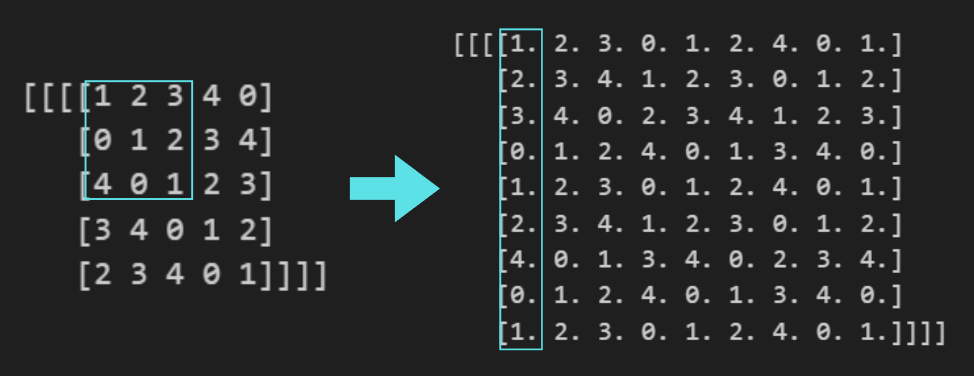

From 02_CNN backward.md, you can see that the model performance is not good because the training set is very small. However, training still takes a long time. Why?

```python
for n in range(N):
    for f in range(F_out):
        for c in range(C):
            for i in range(H_out):
                for j in range(W_out):
                    start_i = i * stride
                    start_j = j * stride
                    g = grad_output[n, f, i, j]

                    region = x_padded[n, c, start_i:start_i+KH, start_j:start_j+KW]
                    dW[f, c] += g * region
                    dx_padded[n, c, start_i:start_i+KH, start_j:start_j+KW] += g * self.W.data[f, c]

        db[f] += np.sum(grad_output[n, f])
```

Using im2col can solve this problem. im2col reshapes all sliding windows of the input into a large 2D matrix, and the filters are reshaped into another matrix. Then, the convolution can be performed as a single matrix multiplication, which is highly optimized in libraries like NumPy or PyTorch. This reduces the number of explicit loops and significantly speeds up both the forward and backward passes.

## Im2col




In the original method, we apply the kernel to each patch of the input one by one, which is slow. The image shows how we can instead extract all patches and stack them as vectors to match the kernel. This creates a large matrix of patches, which can then be multiplied with the kernel all at once, making the computation much faster.

so im2col just reshape matrix to help train faster, no any change value. use in forward pass

in backprop. we need use col2im, use for dL/dX due to
$ \frac{\partial L}{\partial X} = \text{pad}\left(\frac{\partial L}{\partial O}\right) ⋆ \text{rot180}(K) $

```python
for n in range(N):
    for i in range(H_out):
        for j in range(W_out):
            h_start = i * stride
            h_end = h_start + KH
            w_start = j * stride
            w_end = w_start + KW

            window = x_padded[n, :, h_start:h_end, w_start:w_end]

            for f in range(F_out):
                g = grad_output[n, f, i, j]
                db[f] += g
                dW[f] += g * window
                dx_padded[n, :, h_start:h_end, w_start:w_end] += g * self.W.data[f]
```

it use same self.W.data[f] over F_out
the col2im help to make them into one big matrix, with extend to the large matrix by for n in range(N):
for i in range(H_out):
for j in range(W_out):

## Max Pooling Vectorized

```python
for i in range(H_out):
    for j in range(W_out):
        start_i = i * stride_y
        start_j = j * stride_x

        # Current pooling window
        region = x[start_i:start_i+pool_size_y, start_j:start_j+pool_size_x]  # shape: (2, 2)

        # Max value in the window
        max_val = np.max(region)
        out[i, j] = max_val  # scalar

        # Local mask for this window (1 where max, 0 elsewhere)
        local_mask = (region == max_val).astype(int)

        # Add local mask into the global mask
        mask[start_i:start_i+pool_size_y, start_j:start_j+pool_size_x] += local_mask
```

Even though im2col and col2im make Conv2d train faster, max pooling still uses nested loops. It checks each patch to find the maximum value one by one, which is slow.

```python
# Input (5x5)
x = np.array([
    [1, 2, 3, 4, 0],
    [0, 1, 2, 3, 4],
    [4, 0, 1, 2, 3],
    [3, 4, 0, 1, 2],
    [2, 3, 4, 0, 1]
])

pool_size_y, pool_size_x = 2, 2
stride_y, stride_x = 2, 1

H, W = x.shape

H_out = (H - pool_size_y) // stride_y + 1
W_out = (W - pool_size_x) // stride_x + 1

shape = (H_out, W_out, pool_size_y, pool_size_x)
strides = (
    stride_y * x.strides[0],   # move window down SH rows
    stride_x * x.strides[1],   # move window right SW cols
    x.strides[0],              # inside window: move down 1 row
    x.strides[1],              # inside window: move right 1 col
)

windows = np.lib.stride_tricks.as_strided(
    x, shape=shape, strides=strides, writeable=False
)  # shape: (2, 4, 2, 2)
```

```python
# windows
array([[[[1, 2],
         [0, 1]],

        [[2, 3],
         [1, 2]],

        [[3, 4],
         [2, 3]],

        [[4, 0],
         [3, 4]]],


       [[[4, 0],
         [3, 4]],

        [[0, 1],
         [4, 0]],

        [[1, 2],
         [0, 1]],

        [[2, 3],
         [1, 2]]]])
```

NumPy has a function called `np.lib.stride_tricks.as_strided` that can help us create a matrix of all sliding patches from an array **without using loops**.

1. Create patches with `as_strided` \
   This function lets you view the array in a new shape and stride so that each small window (like a 2×2 pooling patch) becomes an element in a higher-dimensional array.\
   Example: for a 5×5 input and 2×2 pooling, `as_strided` creates an array of shape` (H_out, W_out, 2, 2)`, where each `(2,2)` is a patch of the input.

2. Find the maximum of each patch \
   Using `windows.max(axis=(2,3))` finds the maximum value inside each patch. \
   `axis=(2,3)` refers to the last two axes, which are the rows and columns of each patch. \
   This gives the pooled output efficiently `without looping` through every patch manually.

3. Create a mask for max positions \
   `mask_local = (windows == max_vals).astype(int)` creates a local mask for each patch, marking positions where the patch value equals the maximum. \
   We can then place these local masks into a global mask that matches the original input shape. \
   This mask is useful for backpropagation in max pooling, indicating where gradients should flow.

```python
out = windows.max(axis=(2,3))  # max value of each patch

# Create mask of max positions
mask = np.zeros_like(x, dtype=int)
max_vals = windows.max(axis=(2,3), keepdims=True)
mask_local = (windows == max_vals).astype(int)

for i in range(H_out):
    for j in range(W_out):
        mask[i*stride_y:i*stride_y+pool_size_y,
             j*stride_x:j*stride_x+pool_size_x] += mask_local[i,j]
print("out:\n", out)
print("\nmask:\n", mask)
```

```python
out:
 [[2 3 4 4]
 [4 4 2 3]]

mask:
 [[0 1 1 2 0]
 [0 0 0 0 1]
 [1 0 0 1 1]
 [0 2 0 0 0]
 [0 0 0 0 0]]
```

### backward

```python
# Example input (batch=2, channels=2, H=4, W=4)
x = np.array([
    [[
        [1, 2, 1, 0],
        [3, 4, 2, 1],
        [0, 1, 0, 1],
        [1, 0, 2, 3]
    ]]
], dtype=float)

N, C, H, W = x.shape
KH, KW = 2, 2  # pooling window
SH, SW = 2, 2  # stride

# calculate output shape
OH, OW = (H - KH)//SH + 1, (W - KW)//SW + 1

# Forward max pooling with argmax
out = np.zeros((N, C, OH, OW))
argmax = np.zeros((N, C, OH, OW), dtype=int)

for i in range(OH):
    for j in range(OW):
        patch = x[:, :, i*SH:i*SH+KH, j*SW:j*SW+KW]  # shape (N,C,KH,KW)
        out[:, :, i, j] = patch.reshape(N, C, -1).max(axis=2)
        argmax[:, :, i, j] = patch.reshape(N, C, -1).argmax(axis=2)

print("Forward output:\n", out)
print("Argmax indices:\n", argmax)

# Example: SIMPLE grad_output from the next layer
grad_output = np.ones_like(out)

# Backward using argmax
dx = np.zeros_like(x)
for i in range(OH):
    for j in range(OW):
        idx = argmax[:, :, i, j]        # flattened index
        kh = idx // KW                  # row inside pooling window
        kw = idx % KW                   # col inside pooling window

        ih = i*SH + kh                  # row in input
        iw = j*SW + kw                  # col in input
        dx[np.arange(N)[:, None], np.arange(C), ih, iw] += grad_output[:, :, i, j]

print("\nBackward gradient dx:\n", dx)
```

```python
Forward output:
 [[[[4. 2.]
   [1. 3.]]]]
Argmax indices:
 [[[[3 2]
   [1 3]]]]

# Backward gradient dx (1 because we assume all grad_output values are 1)
Backward gradient dx:
 [[[[0. 0. 0. 0.]
   [0. 1. 1. 0.]
   [0. 1. 0. 0.]
   [0. 0. 0. 1.]]]]
```

```python
class MaxPool2d(Module):
    def __init__(self, pool_size=(2,2), stride=None):
        super().__init__()
        if isinstance(pool_size, int):
            pool_size = (pool_size, pool_size)
        self.pool_size = pool_size

        if stride is None:
            stride = pool_size  # default (2,2)
        if isinstance(stride, int):
            stride = (stride, stride)
        self.stride = stride

        self.x = None
        self.argmax = None

    def forward(self, x):
        """
        x: (N, C, H, W)
        """
        self.x = x
        N, C, H, W = x.shape
        KH, KW = self.pool_size
        SH, SW = self.stride

        # Output size
        OH = (H - KH) // SH + 1
        OW = (W - KW) // SW + 1

        # -------- im2col for pooling ---------
        # Create sliding windows using strides trick
        shape = (N, C, OH, OW, KH, KW)
        strides = (
            x.strides[0],
            x.strides[1],
            SH * x.strides[2],
            SW * x.strides[3],
            x.strides[2],
            x.strides[3],
        )

        windows = np.lib.stride_tricks.as_strided(
            x, shape=shape, strides=strides, writeable=False
        )  # (N, C, OH, OW, KH, KW)

        # Flatten window dims → (N, C, OH, OW, KH*KW)
        windows_reshaped = windows.reshape(N, C, OH, OW, KH * KW)

        # Max over last dimension
        out = windows_reshaped.max(axis=4)

        # Store argmax indices for backward
        self.argmax = windows_reshaped.argmax(axis=4)

        return out  # (N, C, OH, OW)

    def backward(self, grad_output):
        """
        grad_output: (N, C, OH, OW)
        return dx: (N, C, H, W)
        """
        x = self.x
        N, C, H, W = x.shape
        KH, KW = self.pool_size
        SH, SW = self.stride

        OH, OW = grad_output.shape[2:]

        # Initialize dx
        dx = np.zeros_like(x)

        # Compute base indices for each pooling region
        for i in range(OH):
            for j in range(OW):
                # Flatten => indices in [0, KH*KW)
                idx = self.argmax[:, :, i, j]  # (N, C)

                # Map flattened index → (kh, kw)
                kh = idx // KW
                kw = idx % KW

                # Build coordinates in input
                ih = i * SH + kh
                iw = j * SW + kw

                # Accumulate gradients
                dx[np.arange(N)[:, None], np.arange(C), ih, iw] += grad_output[:, :, i, j]

        return dx
```
